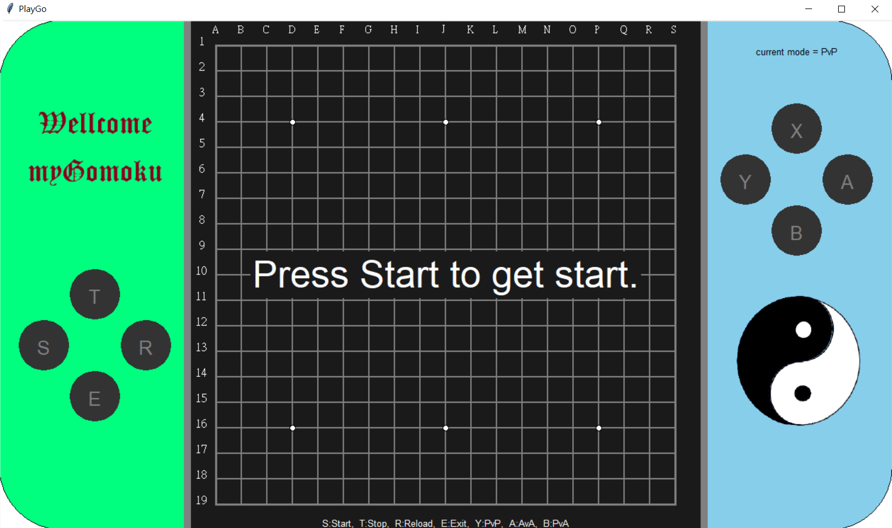

# My Gomoku

> Author : Ya Chen 
> Date : 2021 / 5 / 31 
> List :
>
> > <a href = "#gamescreen">Game Screen</a> <a href = "#description">Description</a> <a href = "#exercise">Exercise Essentials</a> <a href = "#execute">How to Execute</a> <a href = "#reference">Reference</a>

---

 

## Game Screen

 
 

## Description

This project is to develop a <b>Gomoku</b> program ( the main recommended method is "Outsider Opening Gomoku".) Although it is required to be able to play chess, the faster, smarter, and more beautiful the interface is, the better.

 
 

## Exercise Essentials

- How is the chessboard represented?
- How are moves generated?
- How to judge position repetition?
- How deep do I have to run?
- Will I run out of time?
- Will the memory be overloaded?

 
 

## How to Execute

 

## If you have the `make` commend :

If your device supports the `make` command, this will be easier to execute. 
You can type `make` in Terminal to see the output this Python project directly. 
You can also type in : 

> 
>>>make 
> // execute the game

 

## If you do not have the `make` commend :

If your device <b>does not</b> supports the `make` command, there will be a little~ inconvenience. 
You can type in : 

> 
>>>python main.py  
> // This project only has to compile the main file.

 
 

## Reference

1. <a href = "https://blog.csdn.net/qq_44731019/article/details/111330958">Use Python To Implement GO</a>

